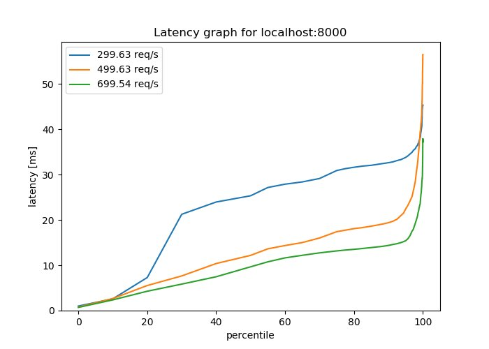

# Wrk2Img


You find [wrk](https://github.com/wg/wrk) and [wrk2](https://github.com/giltene/wrk2) awesome for latency analysis but reading km of log file doesnt seems to be fun ?

Introducing *wrk2img*, your new tool to go to generate latency graph, as easily as possible.

# Goal
wrk2img has two goal:
* Direct use in a pipeline to output beautiful latency graph
* Save multiple output then pipe to wrk2img to combine them

# Installation
`pip install wrk2img`  
Python **3.5** is required.

# How to use
Direct usage : 
* wrk : `wrk --latency http://localhost:8000 | wrk2img output.png`  
* wrk2 : `wrk --latency -R 300 http://localhost:8000 | wrk2img output.png`  


Generating latency data at multiple load level using wrk2 and them combining them  
```
wrk --latency -R 300 http://localhost:8000 > 300
wrk --latency -R 500 http://localhost:8000 > 500
wrk --latency -R 700 http://localhost:8000 > 700
cat 300 500 700 | wrk2img output.png
```


# Feature
* log scale
* transparent background
* change background color
* combine graph from wrk and wrk2 in the same output


